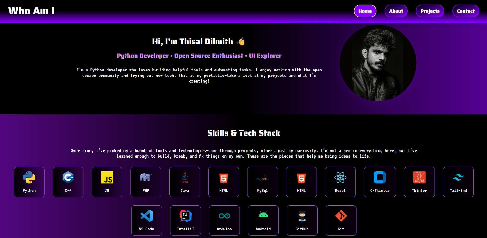

# Who Am I – Personal Portfolio

**Who Am I** is a personal portfolio website built with React, designed to showcase my open-source projects, skills, and online presence. This project serves as a digital identity — a place where others can learn more about who I am, what I’ve built, and where to find me online.

> 🧠 “Not just a portfolio — it's a reflection of the journey so far.”

---

## 🚀 Demo

You can see a live demo here:

👉 [**Who Am I ?**](https://who-am-i-web.netlify.app/)

---

## 📸 Screenshots

> 

---

## 🧑‍💻 Setup Instructions

1. **Clone the repository**

```bash
git clone https://github.com/thisal-d/who-am-i.git
cd who-am-i
````

2. **Install dependencies**

```bash
npm install
```

3. **Run locally**

```bash
npm start
```

4. **Build for production**

```bash
npm run build
```

---

## 💬 Feedback

If you have suggestions or ideas to improve this project, feel free to open an issue or create a pull request.

---

## 🙌 Acknowledgments

Thanks to open-source projects and the developer community that inspires continuous learning and building.
